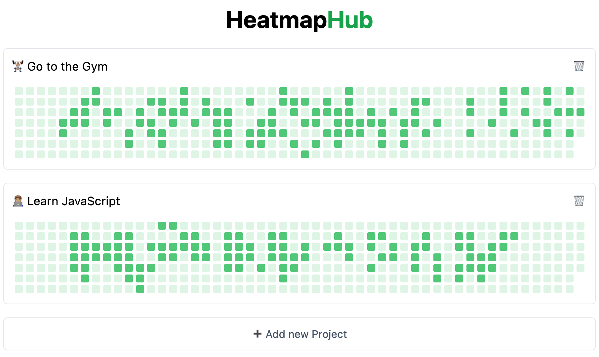

[](https://heatmaphub.com/)

## 🧑🏽‍💻 Development

### Start the project

1. Install dependencies

*We recommend using `pnpm`, but you can use your favorite package manager*

```
pnpm install
```

2. Copy `env.example` into `.env` file and set your firebase environment variables

3. Run the project

```
pnpm dev
```

### Tests

We have two types of tests in this project:

- Unit Tests (isolated and small functions, like utilities)

	```
	pnpm test:unit
	```

- E2E for the whole project

	```
	pnpm test:e2e
	```

### Linting

We use `eslint` for linting and formatting. You can run it with:

```
pnpm lint # linting without fixing
pnpm lint:fix # linting with fixing
```

### 🚀 Deploy

We use Vercel for the hosting, but you can use any other hosting listed in the Astro docs. (See [Astro - Deploy your Atro Site](https://docs.astro.build/en/guides/deploy/))

We have a GitHub Action that automatically deploys the project when new code is pushed to `main` branch and all tests pass.
